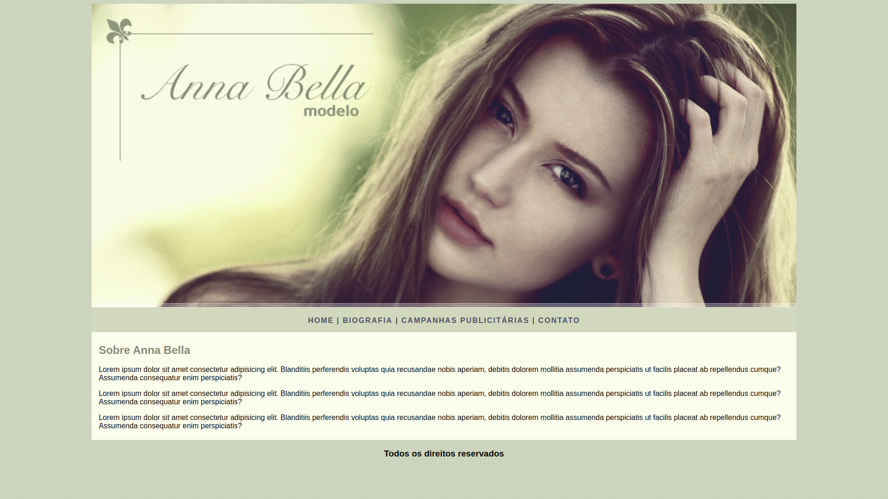

# Projetos:

- [Web fundamentos](#fundamentos)
- [Fashion](#fashion)
- [Anna Bella](#anna)
- [TecBlog](#tecBlog)
- [Login](#login)

## Aviso
Esse projetos foram propostos nos meus cursos, as ideias dos projetos em si **não é minha**, mas cada projeto **eu fiz a mão**.
Esses projetos são simples, eles todos são apenas feitos em **HTML** e **CSS**.

### Web fundamentos

### Fashion

### Anna Bella

### TechBlog

### Login
